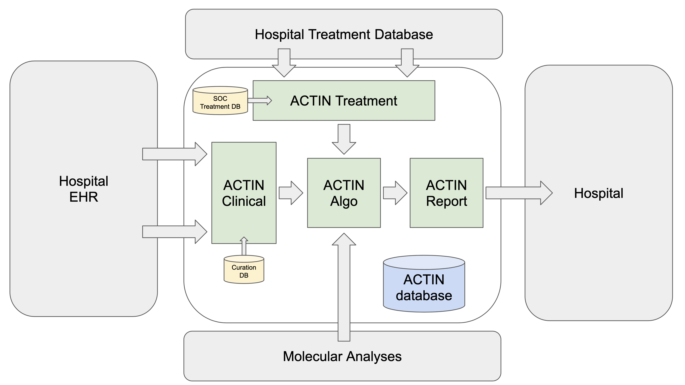

# ACTIN

(in development)

ACTIN is a system that determines and ranks available treatment options for cancer patients based on the following inputs:
 - Comprehensive clinical record of the patient
 - Comprehensive molecular analysis of the tumor
 - Data from all patients previously evaluated and collected by ACTIN

 
More details on the following modules are available from the links below:

Module  | Description
---|---
[ACTIN Clinical](actin-clinical) | Module to ingest and curate an external EHR clinical data stream
[ACTIN Treatment](actin-treatment) | Module to generate a list of available treatment options (SOC and experimental)
[ACTIN Algo](actin-algo) | The algo matching all data from a patient to all available treatment options.
[ACTIN Report](actin-report) | A module that writes the output of algo to a PDF report.
  