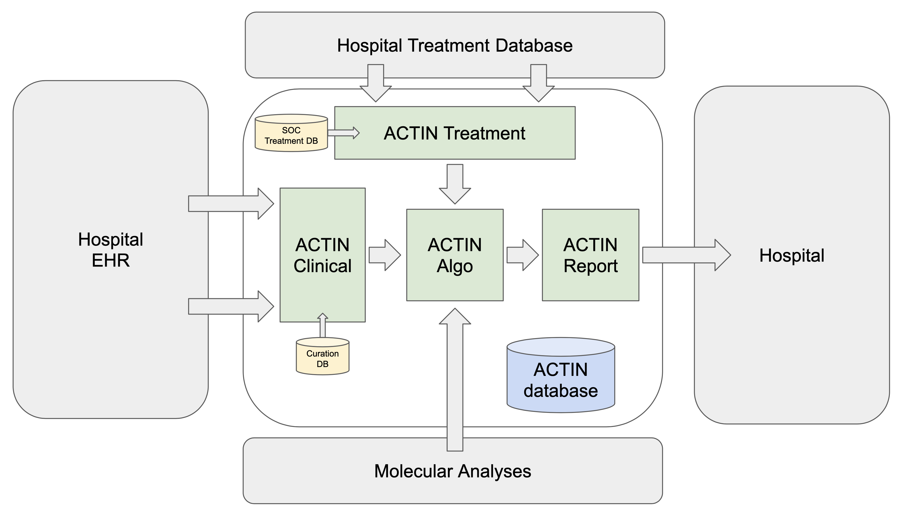

# ACTIN

ACTIN encompasses two products for identifying potential cancer treatment options: **Hartwig Trial Search** and **ACTIN 2.0**.

## Hartwig Trial Search

Hartwig Trial Search (HTS) is a non-medical device that supports physicians in searching for clinical trials.

Based on physician-selected search inputs, the system generates a report containing clinical trials that match those inputs.
The system does not determine patient eligibility for a clinical trial.

## ACTIN 2.0

ACTIN 2.0 is designed to determine available treatment options for cancer patients based on:

- A comprehensive clinical record of the patient
- A comprehensive molecular analysis of the tumor
- A set of available treatment options, including standard-of-care (SOC) and experimental treatments

ACTIN 2.0 is currently in development and is intended to be a medical device under the EU Medical Device Regulation (MDR).

More details on the following modules are available from the links below:

| Module                 | Description                                                                                                                          |
|------------------------|--------------------------------------------------------------------------------------------------------------------------------------|
| [Common](common)       | Common code to be used by all other modules.                                                                                         |
| [Molecular](molecular) | Interpretation of molecular tests and ingestion into ACTIN.                                                                          |
| [Algo](algo)           | Matching all data from a patient to available treatment options.                                                                     |
| [Database](database)   | Capture of all ACTIN data in a database.                                                                                             |
| [Report](report)       | Create PDF reports with matching clinical trials for HTS and patient-centric reports with available treatment options for ACTIN 2.0. |
| [Trial](trial)         | Handles trial information preparing it for processing by other modules.                                                              |
| [System](system)       | Module which bundles everything and adds example patients and reports + regression tests                                             |

