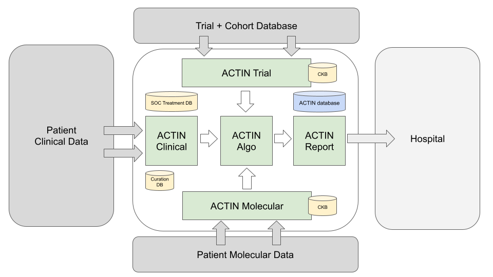

# ACTIN

ACTIN is a system that determines available treatment options for cancer patients based on the following inputs:

- Comprehensive clinical record of the patient
- Comprehensive molecular analysis of the tumor
- Set of all treatment options available (standard-of-care (SOC) and experimental).



More details on the following modules are available from the links below:

| Module                 | Description                                                                                |
|------------------------|--------------------------------------------------------------------------------------------|
| [Clinical](clinical)   | Ingestion and curation of an external electronic health record (EHR) clinical data stream. |
| [Molecular](molecular) | Interpretation of molecular tests and ingestion into ACTIN.                                |
| [Trial](trial)         | Conversion of trial configuration to ACTIN-readable trial database.                        |
| [Algo](algo)           | Matching all data from a patient to available treatment options.                           |
| [Database](database)   | Capture of all ACTIN data in a database.                                                   |
| [Report](report)       | Create a patient-centric PDF report with available treatment options.                      |

### Developing and Releasing ACTIN

To make a change in ACTIN and release the process is as follows:

1. Create a ticket in JIRA and make a branch from that ticket with `git checkout -b ACTIN-#`
2. When changes are complete create a PR by committing pushing your branch and creating a PR via the GitHub UI.
3. This will trigger
   a [CI build in GCP Cloud Build](https://console.cloud.google.com/cloud-build/builds;region=europe-west4?project=actin-build). This build
   only runs the unit tests, the status can be seen in both the GCP console and the GitHub UI.
4. Figure out what your release version will be. This can be done by listing tags and finding the most recent (use `git fetch --tag`
   then `git tag`)
   We follow semantic versioning where:
   - The major version is compatibility. As actin currently has no "clients", we'll reserve this for major technical or functional changes
   - The minor version is for features. This should be incremented for any new feature
   - The patch version is for bug fixes.
5. If you wish to create a JAR to test from your PR branch, push a beta tag for your release version:
    ```shell
   git tag 1.2.3-beta.1
   git push origin 1.2.3-beta.1
    ```
   This will launch a build (also can be
   monitored [here](https://console.cloud.google.com/cloud-build/builds;region=europe-west4?project=actin-build)) which will run all tests
   and create a jar with the same version.
6. Once your code has been reviewed, and testing is done, you can make the real release. The process is that same as beta, just without the
   beta:
    ```shell
    git tag 1.2.3
    git push origin 1.2.3
    ```
7. To deploy and test a version you can use the `deploy_actin_data_vm` script provided in the `scripts` repository. Run it from your laptop,
   it will do the deployment remotely.
   ```shell
   deploy_actin_data_vm 1.2.3
   ```
8. When ready for production use the `deploy_actin_emc_ops_vm` to do the same deployment to the EMC operations vm (Note: For other
   environments similar scripts exist).
   ```shell
   deploy_actin_emc_ops_vm 1.2.3
   ```
  
