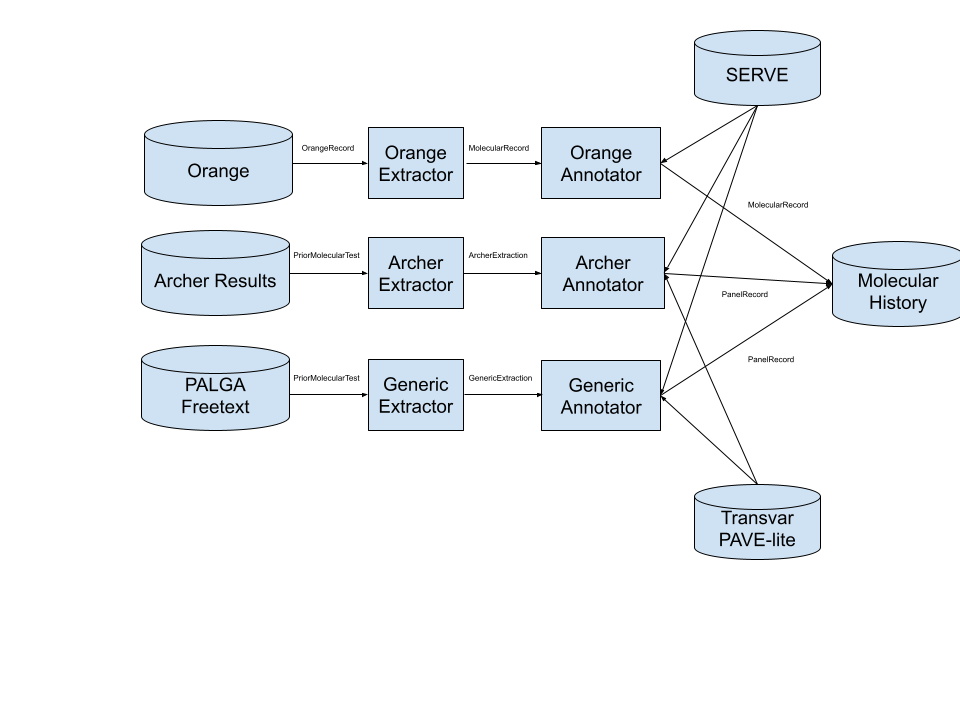

## ACTIN-Molecular

The scope of the ACTIN-Molecular interpreter application is as follows:

1. Ingest all types of molecular tests (IHC, panel NGS, WGS, e.t.c.) and map to the ACTIN-molecular datamodel captured
   in a single molecular history
2. Interpret standardized molecular tests by annotating molecular findings with literature-based knowledge and treatment-evidence
3. Produce a final patient record by merging the standardized and annotated molecular tests with all clinical data.

The molecular interpreter application requires Java 11+ and can be run as follows:

```
java -cp actin.jar com.hartwig.actin.molecular.MolecularInterpreterApplicationKt \
   -clinical_json /path/to/actin_clinical.json \
   -serve_directory /path/to/serve_directory \
   -doid_json /path/to/doid.json \
   -output_directory /path/to/where/patient_record_json_file_is_written
```

In case a patient has received WGS and an ORANGE output is available, this can be provided via `orange_json`:

| Argument    | Example Value        | Details                                                                 | 
|-------------|----------------------|-------------------------------------------------------------------------|
| orange_json | /path/to/orange.json | The path to ORANGE json in case an ORANGE record exists for the patient |

The following assumptions are made about the inputs:

- The clinical JSON is the output of [ACTIN Clinical](https://github.com/hartwigmedical/actin/tree/master/clinical).
- The ORANGE JSON is the JSON output from [ORANGE](https://github.com/hartwigmedical/hmftools/tree/master/orange).
- The SERVE directory holds the output JSON of [SERVE](https://github.com/hartwigmedical/serve/tree/master/algo) and is used for annotation
  and interpretation of the genomic findings.

The following parameters are mandatory and used for interpretation of other molecular tests that are provided via the clinical input:

| Argument                | Example Value                  | Details                                                                                           | 
|-------------------------|--------------------------------|---------------------------------------------------------------------------------------------------|
| ref_genome_fasta_file   | /path/to/ref_genome.fasta      | The path to the 37 ref genome fasta file (standard resource within Hartwig)                       |
| driver_gene_panel       | /path/to/driver_gene_panel.tsv | The path to the 37 driver gene panel (standard resource within Hartwig)                           |
| onco_dnds_database_path | /path/to/onco_dnds.tsv         | The path towards the 37 DnDs values for oncogenes (standard resource within Hartwig)              |
| tsg_dnds_database_path  | /path/to/tsb_dnds.tsv          | The path towards the 37 DnDs values for tumor suppressor genes (standard resource within Hartwig) |
| ensembl_data_dir        | /path/to/ensembl_data_dir      | The path towards the 37 ensembl data directory (standard resource within Hartwig)                 |
| known_fusion_file       | /path/to/known_fusion_file     | The path towards the 37 known fusion file (standard resource within Hartwig)                      |

Note that currently all molecular tests provided by the clinical input have been analysed with respect to ref genome version V37 (GRCh37 or
HG19).

# ACTIN Molecular Datamodel

A single molecular history represents all molecular testing done for a patient. This includes WGS results, large targeted panels, archer,
small panel results and IHC tests. The history is modeled as a list of molecular tests, each with a type and date.

## Molecular test

The molecular test is a common interface used to model any molecular result (e.g. from ORANGE or other molecular testing). It is extended
by the molecular record and a panel record.

| Field           | Example Value             | Details                                                                                              |
|-----------------|---------------------------|------------------------------------------------------------------------------------------------------|
| experimentType  | WGS                       | The type of molecular experiment done (`HARTWIG_WHOLE_GENOME`, `HARTWIG_TARGETED`, `PANEL` or `IHC`) | 
| testTypeDisplay | "NGS Archer"              | The name of the test (optional, if not implicit from the `experimentType`)                           | 
| date            | 2024-01-14                | The date on which the molecular results were obtained (optional)                                     |
| drivers         | See drivers below         |                                                                                                      |
| characteristics | See characteristics below |                                                                                                      |
| evidenceSource  | CKB                       | The name of the provider of the evidence. Currently always `CKB`                                     |

### molecular characteristics

Note that all individual characteristics are expected to be null for tests that don't determine the specific characteristic.

| Field                         | Example Value      | Details                                                                                 |
|-------------------------------|--------------------|-----------------------------------------------------------------------------------------|
| purity                        | 0.78               | The percentage of cells in the sequenced biopsy that originated from the tumor          |
| ploidy                        | 3.1                | The average number of copies of any chromosome in the tumor                             |
| predictedTumorOrigin          | Melanoma (87%)     | The tumor type of origin predicted based on the molecular data along with a likelihood  |
| isMicrosatelliteUnstable      | false              | If true, sample is considered microsatellite unstable                                   |
| microsatelliteEvidence        | See evidence below | The evidence determined for the microsatellite status of specific tumor sample          |                                        
| homologousRepairScore         | 0.5                | The probability of this sample being HR deficient                                       |
| isHomologousRepairDeficient   | false              | If true, sample is considered homologous repair deficient                               |
| brca1Value                    | 0.3                | Part of the total homologous repair score assigned to BRCA1 deficiency                  |
| brca2Value                    | 0.2                | Part of the total homologous repair score assigned to BRCA2 deficiency                  |
| hrdType                       | BRCA1_TYPE         | Type of HRD (`BRCA1_TYPE`, ` BRCA2_TYPE`, `NONE`, `CANNOT_BE_DETERMINED`)               |  
| homologousRepairEvidence      | See evidence below | The evidence determined for the homologous repair status of specific tumor sample       |
| tumorMutationalBurden         | 14.2               | Number of mutations in the genome per Mb                                                |
| hasHighTumorMutationalBurden  | true               | If true, sample is considered to have a high tumor mutational burden (otherwise, low)   |
| tumorMutationalBurdenEvidence | See evidence below | The evidence determined for the tumor mutational burden status of specific tumor sample |
| tumorMutationalLoad           | 115                | Number of missense mutations across the genome                                          |
| hasHighTumorMutationalLoad    | false              | If true, sample is considered to have a high tumor mutational load (otherwise, low)     |
| tumorMutationalLoadEvidence   | See evidence below | The evidence determined for the tumor mutational load of specific tumor sample          |

### N molecular drivers

Every potential driver event has the following fields ('general driver fields'):

| Field            | Example Value      | Details                                                                                                                |
|------------------|--------------------|------------------------------------------------------------------------------------------------------------------------|
| isReportable     | true               | Indicates whether this driver event is considered relevant enough to be explicitly mentioned in a clinical report      |
| event            | BRAF V600E         | A human readable string summarizing the driver event                                                                   |
| driverLikelihood | HIGH               | An optional field that indicates the likelihood of the mutation being a driver (either `HIGH`, `MEDIUM`, `LOW` if set) |
| evidence         | See evidence below | The evidence determined for this driver in the specific tumor sample                                                   |

Furthermore, every driver event affecting a single gene is assigned the following fields ('gene alteration fields'):

| Field                          | Example Value    | Details                                                                                                                                                                                                                |
|--------------------------------|------------------|------------------------------------------------------------------------------------------------------------------------------------------------------------------------------------------------------------------------|
| gene                           | BRAF             | The name of the gene                                                                                                                                                                                                   |
| geneRole                       | ONCO             | The role of the gene in cancer (either `BOTH`, `ONCO`, `TSG`, or `UNKNOWN`)                                                                                                                                            |
| proteinEffect                  | GAIN_OF_FUNCTION | The effect the specific driver has on the gene (one of `UNKNOWN`, `AMBIGIOUS`, `NO_EFFECT`, `NO_EFFECT_PREDICTED`, `LOSS_OF_FUNCTION`, `LOSS_OF_FUNCTION_PREDICTED`, `GAIN_OF_FUNCTION`, `GAIN_OF_FUNCTION_PREDICTED`) |
| isAssociatedWithDrugResistance | true             | An optional boolean indicating the specific driver event is associated with some form of drug resistance                                                                                                               |

#### N variants

In addition to the (gene) driver fields, the following data is captured for all detected variants:

| Field                  | Example Value | Details                                                                 |
|------------------------|---------------|-------------------------------------------------------------------------|
| chromosome             | 1             | The chromosome in which the event was detected                          |
| position               | 41206120      | Genomic position in respect to chromosome and ref genome                |
| ref                    | A             | The base(s) as found in the reference genome at this position           |
| alt                    | G             | The base(s) as found in the sample analyzed                             |
| type                   | SNV           | The type of variant (one of `SNV`, `MNV`, `INSERT`, `DELETE`)           |
| variantAlleleFrequency | 0.63          | The percentage of genomic reads containing this variant                 |
| canonicalImpact        | See impact    | The impact of this variant on the canonical transcript of the gene      |
| otherImpacts           | See impact    | The impact of this variant on other transcripts of the gene             |
| extendedVariantDetails | See below     | Optional field with extended details on the variant                     |
| isHotspot              | true          | Indicates whether this specific variant is a known (pathogenic) hotspot |

Depending on the type of molecular test, more details may be available for a variant as follows:

| Field             | Example Value | Details                                                                                             |
|-------------------|---------------|-----------------------------------------------------------------------------------------------------|
| variantCopyNumber | 2.3           | The number of copies of this variant in the tumor                                                   |
| totalCopyNumber   | 4.0           | The total number of copies in the tumor on the variant genomic position                             |
| isBiallelic       | false         | Indicates whether all alleles in the tumor are affected by this variant or not                      |
| phaseGroups       | 1, 2          | The phasing groups this variant belongs to. Variants that are phased share at least one phase group |
| clonalLikelihood  | 0.98          | Likelihood that the variant exists in every tumor cell (hence: is clonal)                           |

The following data is captured as impact of a variant on a specific transcript:

| Field             | Example Value             | Details                                                                  |
|-------------------|---------------------------|--------------------------------------------------------------------------|
| transcriptId      | ENST00001                 | The ensembl ID of the transcript                                         | 
| hgvsCodingImpact  | c.123G>T                  | The HGVS coding impact on the transcript                                 |
| hgvsProteinImpact | p.V41E                    | The HGVS protein impact on the transcript                                |
| affectedCodon     | 41                        | Optional field, the codon that is affected by the variant                |
| affectedExon      | 2                         | Optional field, the exon that is affected by the variant                 |
| isSpliceRegion    | false                     | Indicates whether this variant affects a splice region of the transcript |
| effects           | MISSENSE, PHASED_MISSENSE | A set of effects that this variant has on the transcript                 |
| codingEffect      | MISSENSE                  | A single, summarized coding effect this variant has on the transcript    |

#### N copy numbers

In addition to the (gene) driver fields, the following data is captured per copy number:

| Field           | Example Value | Details                                                                     |
|-----------------|---------------|-----------------------------------------------------------------------------|
| canonicalImpact | See below     | The impact of the copy number event on the canonical transcript of the gene |
| otherImpacts    | See below     | The impacts of this copy number event on other transcripts of this gene     |

| Field        | Example Value   | Details                                                                        |
|--------------|-----------------|--------------------------------------------------------------------------------|
| transcriptId | ENST00000646891 | The ensembl ID of the transcript                                               | 
| type         | FULL_GAIN       | The type of copy number (either `FULL_GAIN`, `PARTIAL_GAIN`, `LOSS` or `NONE`) |
| minCopies    | 12              | The minimum copy number of the gene along the canonical transcript of the gene |
| maxCopies    | 18              | The maximum copy number of the gene along the canonical transcript of the gene |

#### N homozygous disruptions

For homozygous disruptions, no additional data is captured beyond the (gene) driver fields.

#### N disruptions

In addition to the (gene) driver fields, the following data is captured per disruption:

| Field                 | Example Value | Details                                                                                                        |
|-----------------------|---------------|----------------------------------------------------------------------------------------------------------------|
| type                  | BND           | The type of disruption (either `BND`, `DEL`, `DUP`, `INF`, `INS`, `INV` or `SGL`)                              |
| junctionCopyNumber    | 1.1           | Number of copies affected by this disruption                                                                   |
| undisruptedCopyNumber | 1.8           | Remaining number of copies not impacted by this disruption                                                     |
| regionType            | INTRONIC      | The region where this disruption starts or ends (either `INTRONIC`, `EXONIC`, `UPSTREAM`, `DOWNSTREAM` or `IG` |
| codingContext         | UTR_5P        | The coding context of the disruption (either `ENHANCER`, `UTR_5P`, `CODING`, `NON_CODING`, `UTR_3P`            |
| clusterGroup          | 3             | The ID of the cluster this disruption belongs to                                                               |

#### N fusions

In addition to the general driver fields, the following data is captured per fusion:

| Field                          | Example Value    | Details                                                                  |
|--------------------------------|------------------|--------------------------------------------------------------------------|
| geneStart                      | EML4             | The gene that makes up the 5' part of the fusion                         |
| geneEnd                        | ALK              | The gene that makes up the 3' part of the fusion                         |
| driverType                     | KNOWN_PAIR       | The type of driver fusion                                                |
| proteinEffect                  | GAIN_OF_FUNCTION | The type of protein effect of the fusion product                         |
| isAssociatedWithDrugResistance | true             | Indicates whether the fusion is associated with drug resistance          | 
| geneTranscriptStart            | ENST001          | The ensembl ID of the transcript that makes up the 5' part of the fusion |
| geneTranscriptEnd              | ENST002          | The ensembl ID of the transcript that makes up the 3' part of the fusion |
| fusedExonUp                    | 10               | The last exon of the 5' gene included in the fusion                      |
| fusedExonDown                  | 22               | The first exon of the 3' gene included in the fusion                     |

#### N viruses

In addition to the general driver fields, the following data is captured per virus:

| Field        | Example Value                | Details                                                                                      |
|--------------|------------------------------|----------------------------------------------------------------------------------------------|
| name         | Human papillomavirus type 16 | Name of the virus found in the tumor sample                                                  |
| type         | HUMAN_PAPILLOMA_VIRUS        | The type of virus found in the tumor sample                                                  |
| isReliable   | false                        | Boolean indicated whether the virus has reliably been found and could be considered a driver | 
| integrations | 3                            | Number of integrations of detected virus in the tumor sample                                 |

## Molecular record

A molecular record is the most extensive implementation of a molecular test, and contains a number of extra fields in addition to the
molecular test interface.

### Additional base properties

| Field               | Example Value | Details                                                                                                                              |
|---------------------|---------------|--------------------------------------------------------------------------------------------------------------------------------------|
| sampleId            | SAMPLE_01     | An identifier for the specific molecular test                                                                                        | 
| refGenomeVersion    | V37           | The version of the reference genome used throughout the analysis, either `V37` or `V38`                                              |
| externalTrialSource | CKB           | The name of the provider of external trials (which are trials that may not be known in ACTIN trial database). Currently always `CKB` |
| containsTumorCells  | true          | If false, implies that the tumor cell percentage in the biopsy was lower than the lowest detectable threshold                        |
| isContaminated      | false         | If true, significant contamination with other (human) samples has been detected in the analysed sample                               |  

#### Additional N HLA alleles (with a single `isReliable` boolean indicating whether the HLA results are reliable)

| Field               | Example Value | Details                                                                              |
|---------------------|---------------|--------------------------------------------------------------------------------------|
| name                | A*02:01       | Name of the HLA allele                                                               |
| tumorCopyNumber     | 1.2           | The number of copies of this HLA allele in the tumor sample.                         |
| hasSomaticMutations | false         | A boolean indicating whether any mutations have occurred in this allele in the tumor |

#### Additional N pharmacogenomic entries

| Field      | Example Value | Details                                             |
|------------|---------------|-----------------------------------------------------|
| gene       | DPYD          | The gene for which the pharmaco entry is applicable |
| haplotypes | See below     | Haplotypes found for the gene                       |

Where a single haplotype has the following properties:

| Field       | Example Value   | Details                                                                                                      |
|-------------|-----------------|--------------------------------------------------------------------------------------------------------------|
| allele      | 1*              | An identifier of the specific allele found                                                                   |
| alleleCount | 2               | Number of alleles found that belong to the `allele` identifier, either 1 or 2                                | 
| function    | NORMAL_FUNCTION | Functional impact of corresponding haplotype (either `NORMAL_FUNCTION`, `REDUCED_FUNCTION` OR `NO_FUNCTION`) |

## Panel record

A panel record is a more minimalistic implementation of the molecular test interface. In addition to all the fields from molecular test, a
single set of `testedGenes` can be present for any panel record.

## Clinical evidence

The datamodel supports clinical evidence on driver events as well as various characteristics. The evidence consists of a set of treatment
evidences and a set of external trials (trials that are fed from an external source rather than ACTIN's trial database).

### Molecular matches

For every match made between treatment/trial and biomarker, a molecular match record exists with the following properties:

| Field           | Example Value | Details                                                                                                                     |
|-----------------|---------------|-----------------------------------------------------------------------------------------------------------------------------|
| sourceDate      | 2022-01-21    | The date in which the original evidence was added to the evidence source                                                    | 
| sourceEvent     | BRAF act mut  | The actual event that was used by the evidence source (prior to mapping in CKB)                                             |
| isCategoryEvent | false         | If true, The source event is a category event (such as "BRAF activation") rather than a specific variant such as BRAF V600E |

### Treatment evidence

A single entry of treatment evidence has the following properties:

| Field                | Example Value     | Details                                                                                                                                                                |
|----------------------|-------------------|------------------------------------------------------------------------------------------------------------------------------------------------------------------------|
| treatment            | Pembrolizumab     | The name of the treatment for which the evidence applies.                                                                                                              | 
| molecularMatch       | See above         | Details about how the evidence was matched against the driver or characteristic                                                                                        |
| applicableCancerType | Colorectal Cancer | The cancer type for which the evidence is applicable                                                                                                                   |
| isOnLabel            | true              | True when the patient has a cancer type that is either the applicable cancer type or a more specific version of this cancer type                                       |
| evidenceLevel        | A                 | The level of the evidence following AMP/ASCO/CAP model (`A`, `B`, `C` or `D`)                                                                                          |
| evidenceLevelDetails | PRECLINICAL       | Provides more granularity on the evidence level (`PRECLINICAL`, `CASE_REPORTS_SERIES`, `CLINICAL_STUDY`, `FDA_APPROVED`, `GUIDELINE`, `FDA_CONTRAINDICATED`, `UNKNOWN` |
| evidenceDirection    | See below         | A set of of properties indicating whether this is evidence for, or against suggesting the treatment.                                                                   | 
| evidenceYear         | 2019              | The year in which the evidence was generated (supporting paper was published)                                                                                          |
| efficacyDescription  | This works        | A human-readable summary of the actual efficacy.                                                                                                                       |

Evidence direction has the following properties:

| Field               | Example Value | Details                                                                                                    |
|---------------------|---------------|------------------------------------------------------------------------------------------------------------|
| hasPositiveResponse | true          | If true, the evidence implies that a tumor with this biomarker can expect a positive response on treatment | 
| hasBenefit          | true          |                                                                                                            |
| isResistant         | false         | If true, the evidence implies that a tumor with this biomarker resists the treatment                       |
| isCertain           | false         | If true, the evidence direction is considered certain rather than predicted                                | 

### Eligible (external) trials

A single eligible external trial has the following properties:

| Field                 | Example Value                  | Details                                                                                   |
|-----------------------|--------------------------------|-------------------------------------------------------------------------------------------|
| nctId                 | NCT0000001                     | The NCT ID (clinicaltrials.gov) of this trial                                             |  
| title                 | DRUP                           | The name of a trial                                                                       |
| countries             | A set of countries, see below  | All country details relevant to this trial                                                |
| molecularMatches      | See above                      | The match details for every different molecular criterium that was matched for this trial | 
| applicableCancerTypes | Colorectal Cancer, Solid Tumor | The set of all cancer types which are considered on-label for this trial                  |
| url                   | https://url.com                | A link to the trial website for potentially more information                              | 

## Interpretation to ACTIN molecular datamodel

### ORANGE

The interpretation of ORANGE to the ACTIN datamodel consists of two parts:

1. Generic annotating of all mutations and various characteristics in ORANGE with additional gene annotation and clinical evidence.
2. Mapping all fields, annotated mutations and annotated characteristics to the ACTIN datamodel.

### Integration of non-ORANGE molecular results

Molecular results which are not ORANGE are interpreted from the clinical data, using the prior molecular test list. These results are
normalized and integrated into the molecular history, which can be processed by downstream rules without specific knowledge about what type
of test was done. This integration process is documented in the diagram below.

Note: IHC tests are not included below as they do not provide molecular events which can be annotated. They follow a similar path, but
have no annotation step, and cannot be used in molecular rules requiring drivers.



The flow of data from provider to rule evaluation follows these steps:

- An extractor transforms the data into a data model which more easily supports annotation.
- An annotator adds evidence (see [Evidence annotation](#evidence-annotation)). In the case of panel tests not extracted from ORANGE
  results, we also add genomic position and driver likelihood.
- The annotators produce either a PanelRecord or MolecularRecord. These both conform to the MolecularTest interface and are combined in a
  single list in the molecular history.
- Molecular rules can then evaluate the molecular history.

#### 1. Annotation of mutations and characteristics

#### Additional gene annotation

Every variant, copy number and disruption is annotated with `geneRole`, `proteinEffect` and `isAssociatedWithDrugResistance`. Furthermore,
every fusion is annotated with `proteinEffect` and `isAssociatedWithDrugResistance`.

The annotation algo tries to find the best matching entry from SERVE's mapping of the `CKB_EVIDENCE` database as follows:

- For variants the algo searches in the following order:
    - Is there a hotspot match for the specific variant? If yes, use hotspot annotation.
    - Is there a codon match for the specific variant's mutation type? If yes, use codon annotation.
    - Is there an exon match for the specific variant's mutation type? If yes, use exon annotation.
    - Else, fall back to gene matching.
- For copy numbers the algo searches in the following order:
    - Is there a copy number specific match? If yes, use copy number specific annotation.
    - Else, fall back to gene matching.
- For homozygous disruptions:
    - Is there copy number loss specific match? If yes, use copy number loss annotation.
    - Else, fall back to gene matching.
- For disruptions, a gene match is performed.
- For fusions, the algo searches in the following order:
    - Is there a known fusion with an exon range that matches the specific fusion? If yes, use fusion annotation.
    - Else, fall back to known fusion match ignoring specific exon ranges.

Do note that gene matching only ever populates the `geneRole` field. Any gene-level annotation assumes that the `proteinEffect` is unknown.

#### Evidence annotation

Every (potential) molecular driver and characteristic is annotated with evidence from SERVE. In practice all evidence comes
from `CKB_EVIDENCE` except for external trials which is populated by `CKB_TRIAL`. The evidence annotations occur in the following order:

1. Collect all on-label and off-label applicable evidences that match with the driver / characteristic
2. Map the evidences to the ACTIN evidence datamodel (above).

Evidence is considered on-label in case the applicable evidence tumor DOID is equal to or a parent of the patient's tumor doids, and none of
the patient's tumor DOIDs (or parents thereof) is excluded by the evidence.

Evidence from SERVE is collected per driver / characteristic as follows:

| Driver / Characteristic        | Evidence collected                                                                                                                                                                                                                        |
|--------------------------------|-------------------------------------------------------------------------------------------------------------------------------------------------------------------------------------------------------------------------------------------|
| microsatellite status          | All signature evidence of type `MICROSATELLITE_UNSTABLE` in case tumor has MSI                                                                                                                                                            |
| homologous repair status       | All signature evidence of type `HOMOLOUG_RECOMBINATION_DEFICIENT` in case tumor is HRD                                                                                                                                                    |
| tumor mutational burden status | All signature evidence of type `HIGH_TUMOR_MUTATIONAL_BURDEN` in case tumor has high TMB                                                                                                                                                  |
| tumor mutational load status   | All signature evidence of type `HIGH_TUMOR_MUTATIONAL_LOAD` in case tumor has high TML                                                                                                                                                    |
| variant                        | In case the variant has `HIGH` driver likelihood: the union of all evidence matching for exact hotspot, matching on range and mutation type, and matching on gene level for events of type `ACTIVATION`, `INACTIVATION` or `ANY_MUTATION` |
| copy number                    | In case of an amplification, all gene level events of type `AMPLIFICATION`. In case of a loss, all gene level events of type `DELETION`                                                                                                   |
| homozygous disruption          | All gene level evidence of type `DELETION`, `INACTIVATION` or `ANY_MUTATION`                                                                                                                                                              | 
| disruption                     | All gene level evidence of type `ANY_MUTATION` in case the disruption is reported                                                                                                                                                         | 
| fusion                         | In case the fusion is reported, the union of promiscuous matches (gene level events of type `FUSION`, `ACTIVATION` or `ANY_MUTATION`) with fusion matches (exact fusion with fused exons in the actionable exon range)                    | 
| virus                          | For any reported virus, evidence is matched for `HPV_POSITIVE` and `EBV_POSITIVE`                                                                                                                                                         | 

The evidences are then mapped to the ACTIN evidence model as follows:

| Type of CKB evidence                      | Mapping in ACTIN evidence datamodel |
|-------------------------------------------|-------------------------------------|
| On-Label, certain responsive, A level     | Approved treatment                  | 
| On-label, uncertain responsive, A-level   | On-label experimental treatment     | 
| On-label, certain responsive, B-level     | On-label experimental treatment     |
| On-label, uncertain responsive, B-level   | Pre-clinical treatment              |
| On-label, responsive, C-level or D-level  | Pre-clinical treatment              |
| Off-label, responsive, A-level            | Off-label experimental treatment    | 
| Off-label, certain responsive, B-level    | Off-label experimental treatment    |
| Off-label, uncertain responsive, B-level  | Pre-clinical treatment              |
| Off-label, responsive, C-level or D-level | Pre-clinical treatment              |
| Resistant, A-level                        | Known resistant treatment           |
| Certain resistant, B-level                | Known resistant treatment           |
| Uncertain resistant, B-level              | Suspect resistant treatment         |
| Resistant, C-level or D-level             | Suspect resistant treatment         |

Notes:

- All responsive on-label evidence from `CKB_TRIAL` is mapped to external trials in ACTIN datamodel
- Responsive treatments are cleaned according to their evidence level. The highest evidence levels for each treatment are kept (such that an
  approved treatment cannot also be a pre-clinical treatment)
- Resistant treatments are retained only in case responsive evidence for the same treatment is present as well (either approved or
  experimental).

#### 2. Mapping of all ORANGE fields to ACTIN molecular datamodel

The ACTIN datamodel is created from the ORANGE data according to below.

Molecular base data:

| Field                | Mapping                                                               |
|----------------------|-----------------------------------------------------------------------|
| sampleId             | The ORANGE field `sampleId`                                           |
| type                 | Extracted from ORANGE field `experimentType`                          |
| refGenomeVersion     | Extracted from ORANGE field `refGenomeVersion`                        | 
| date                 | The ORANGE field `samplingDate`                                       |
| evidenceSource       | Hard-coded to `CKB_EVIDENCE`                                          |
| externalTrialSource  | Hard-coded to `CKB_TRIAL`                                             |
| containsTumorCells   | TRUE in case `FAIL_NO_TUMOR` is one of the purple QC states           |
| isContaminated       | TRUE in case `FAIL_CONTAMINATED` is one of the purple QC states       |
| hasSufficientPurity  | TRUE in case `WARN_LOW_PURITY` is *not* present in purple QC states   |
| hasSufficientQuality | Derived field, TRUE in case containsTumorCells and not isContaminated |

Molecular characteristics:

| Field                        | Mapping                                                         |
|------------------------------|-----------------------------------------------------------------|
| purity                       | The PURPLE field `purity`                                       |
| ploidy                       | The PURPLE field `ploidy`                                       | 
| predictedTumorOrigin         | The CUPPA best cancer-type prediction along with the likelihood |
| isMicrosatelliteUnstable     | The interpretation of PURPLE `microsatelliteStabilityStatus`    |
| homologousRepairScore        | The CHORD field `hrdValue`                                      |
| isHomologousRepairDeficient  | The interpretation of CHORD `hrStatus`                          |
| tumorMutationalBurden        | The PURPLE field `tumorMutationalBurden`                        |
| hasHighTumorMutationalBurden | The interpretation of PURPLE `tumorMutationalBurdenStatus`      |
| tumorMutationalLoad          | The PURPLE field `tumorMutationalLoad`                          |
| hasHighTumorMutationalLoad   | The interpretation of PURPLE `tumorMutationalLoadStatus`        |

Driver events:

| Driver Type           | Algo             | Details                                                                                                                            |
|-----------------------|------------------|------------------------------------------------------------------------------------------------------------------------------------|
| variants              | PURPLE           | Union of all somatic variants affecting a known gene and either reported or having a coding effect, and reported germline variants |
| copyNumbers           | PURPLE           | All somatic amplifications and losses affecting a known gene                                                                       |
| homozygousDisruptions | LINX             | All somatic homozygous disruptions affecting a known gene                                                                          |
| disruptions           | LINX             | All somatic gene disruptions affecting a known gene that is not also lost                                                          |
| fusions               | LINX             | All fusions that have a known gene either as 5' or 3' partner                                                                      |
| viruses               | VirusInterpreter | All viruses.                                                                                                                       |

Note that all floating point numbers are rounded to 3 digits when ingesting data into ACTIN:

- variants: `variantCopyNumber`, `totalCopyNumber`, `clonalLikelihood`
- disruptions: `junctionCopyNumber`, `undisruptedCopyNumber`

Other data:

The HLA entries are extracted from LILAC as follows:

- `isReliable` is set to true in case the LILAC QC value equals `PASS`
- For each HLA allele, the field `hasSomaticVariants` is set to true in case any of `somaticMissense`, `somaticNonsenseOrFrameshift`
  , `somaticSplice` or `somaticInframeIndel` is non-zero

The pharmacogenomics entries are extracted from PEACH.

## Test Data

A tiny reference genome and corresponding Ensembl data cache is provided. This reference fasta requires additional metadata files to
be created, when updating this reference genome perform the following steps in the folder containing the fasta file:

```bash
$ rm refsequence.dict
$ samtools faidx refsequence.fasta
$ gatk CreateSequenceDictionary -R refsequence.fasta
```
